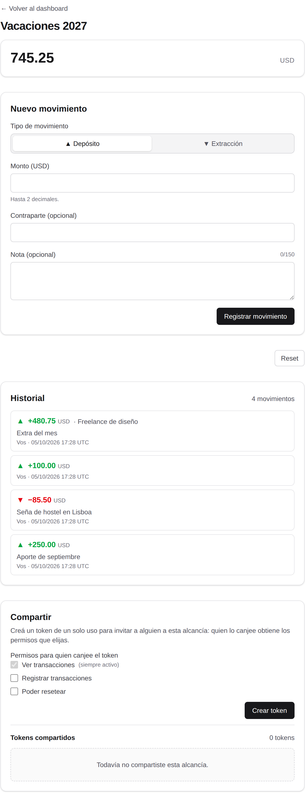
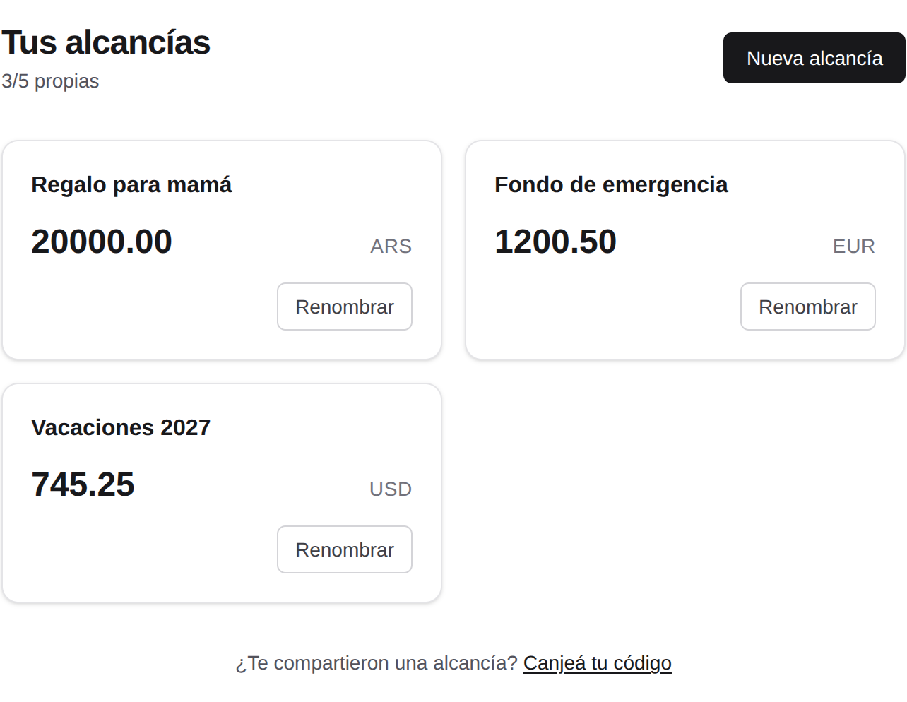

# Chain Money

<div align="center">

[](https://github.com/beresiartejuan/chain-money/actions/workflows/ci.yml)

</div>

<p align="center">
  
</p>

Aplicación web para registrar los movimientos de dinero de **alcancías compartidas**: cada usuario puede crear hasta 5 alcancías con moneda fija y anotar depósitos y extracciones. Compartir se hace con **tokens de acceso de un solo uso** (con permisos configurables por el dueño). El **historial es inmutable** —nada se edita ni se borra, el reset es un evento más— y el balance se **calcula** desde el historial, sincronizado de forma incremental en el cliente.

## Características

- 🔒 **Historial inmutable**: depósitos, extracciones y resets con autor y fecha; nada es editable ni borrable (enforced también por triggers en la base de datos).
- 🪙 **Tokens de un solo uso**: invitá a alguien con un token que se muestra una única vez y canjeable solo por usuarios registrados; elegís si puede ver, registrar movimientos o resetear.
- 🧮 **Balance calculado, nunca almacenado**: se deriva del historial; el cliente lo sincroniza de forma incremental (delta por cursor, caché local).
- 🏦 **Hasta 5 alcancías por usuario**, cada una con moneda fija y UUIDv7.
- 🛡️ **Sesiones robustas**: cookies httpOnly, rate limiting en login/recuperación/canje, recovery phrase cifrada (AES-256-GCM) en lugar de email.

## Vista general



## Stack

- [Next.js](https://nextjs.org) 16 (App Router) + React 19
- Tailwind CSS v4
- [Drizzle ORM](https://orm.drizzle.team) + Turso (libSQL)
- Vitest · Biome · pnpm

## Empezar

```bash
pnpm install
cp .env.example .env   # configurar TURSO_DATABASE_URL (file:./local.db para empezar)
pnpm db:migrate
pnpm dev
```

Abrir [http://localhost:3000](http://localhost:3000). Para más detalles de configuración, variables de entorno y comandos, ver [`docs/DEVELOPMENT.md`](./docs/DEVELOPMENT.md).

## Documentación

- [`docs/README.md`](./docs/README.md) — índice de la documentación del proyecto.
- [`docs/PRODUCT.md`](./docs/PRODUCT.md) — definición de producto y decisiones de diseño.
- [`docs/ARCHITECTURE.md`](./docs/ARCHITECTURE.md) — arquitectura (frontend, backend, flujos de datos).
- [`docs/DATABASE.md`](./docs/DATABASE.md) — esquema, migraciones y triggers de inmutabilidad.
- [`docs/DEVELOPMENT.md`](./docs/DEVELOPMENT.md) — flujo de desarrollo local, tests y convenciones.
- [`tasks/README.md`](./tasks/README.md) — plan de tareas y estado de construcción.

## Estado del proyecto

✅ **Completo** — 96/96 tareas del plan ([tasks/README.md](./tasks/README.md)): 535 tests en 55 archivos, cobertura ~98% líneas / ~95% ramas / 100% funciones (umbrales: 80/80/70, forzados en CI), lint y build en verde.